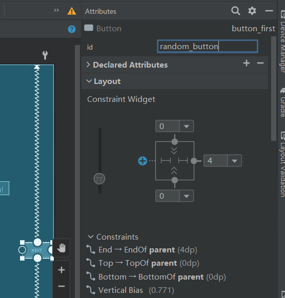

# 创建第一个Kotlin应用程序

- 创建Basic Activity框架


- 等待下载
- 换源

```
pluginManagement {
    repositories {
        gradlePluginPortal()
        google()
        mavenCentral()
        maven { url 'https://maven.aliyun.com/nexus/content/groups/public/' }
        maven { url 'https://maven.aliyun.com/nexus/content/repositories/jcenter' }
        maven { url 'https://maven.aliyun.com/nexus/content/repositories/google' }
        maven { url 'https://maven.aliyun.com/nexus/content/repositories/gradle-plugin' }
        maven { url "https://jitpack.io" }
    }
}
dependencyResolutionManagement {
    repositoriesMode.set(RepositoriesMode.FAIL_ON_PROJECT_REPOS)
    repositories {
        google()
        mavenCentral()
        maven { url 'https://maven.aliyun.com/nexus/content/groups/public/' }
        maven { url 'https://maven.aliyun.com/nexus/content/repositories/jcenter' }
        maven { url 'https://maven.aliyun.com/nexus/content/repositories/google' }
        maven { url 'https://maven.aliyun.com/nexus/content/repositories/gradle-plugin' }
        maven { url "https://jitpack.io" }
    }
}
rootProject.name = "My Application"
include ':app'
```


- 构建好后运行

- 这里我发现所有文件名是红色

  - 解决办法

    将.idea文件里面修改一下

  


- 运行结果


# 查看布局编辑器

# 布局文件


- 修改文本


- 转到申明


- 修改字体属性


- 重新运行


# 添加按钮和约束

- 修改布局

将id也修改


- 删除约束


- 更改组件文本


- 更新Next按钮




- 添加第三个按钮


修改文本


对之前的修改了一点

- 重新运行


报错了，查找源码应该是按钮修改了，重新引用

看代码这个按钮估计是进行重定向页面的，但是我还不知道那个按钮等会是用来跳转页面的，所以先随便指定一个


# 更新按钮和文本框的外观


- 设置代码自动补全


为Toast按钮添加一个toast消息


完善第二界面的代码


- 检查导航图


# 启用SafeArgs


# 创建导航动作的参数


- 运行结果


