# 构建CameraX应用

## 创建项目

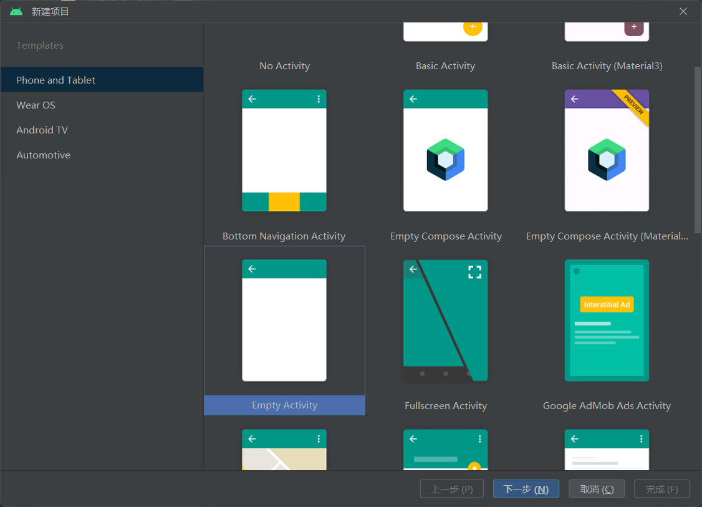

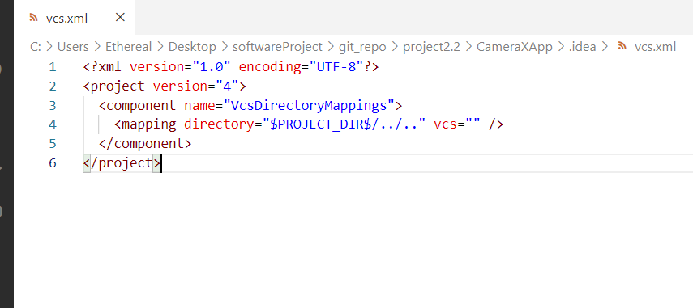

**换源**

```xml
pluginManagement {
    repositories {
        gradlePluginPortal()
        google()
        mavenCentral()
        maven { url 'https://maven.aliyun.com/nexus/content/groups/public/' }
        maven { url 'https://maven.aliyun.com/nexus/content/repositories/jcenter' }
        maven { url 'https://maven.aliyun.com/nexus/content/repositories/google' }
        maven { url 'https://maven.aliyun.com/nexus/content/repositories/gradle-plugin' }
        maven { url "https://jitpack.io" }
    }
}
dependencyResolutionManagement {
    repositoriesMode.set(RepositoriesMode.FAIL_ON_PROJECT_REPOS)
    repositories {
        google()
        mavenCentral()
        maven { url 'https://maven.aliyun.com/nexus/content/groups/public/' }
        maven { url 'https://maven.aliyun.com/nexus/content/repositories/jcenter' }
        maven { url 'https://maven.aliyun.com/nexus/content/repositories/google' }
        maven { url 'https://maven.aliyun.com/nexus/content/repositories/gradle-plugin' }
        maven { url "https://jitpack.io" }
    }
}
rootProject.name = "CameraXApp"
include ':app'
```

## 添加依赖

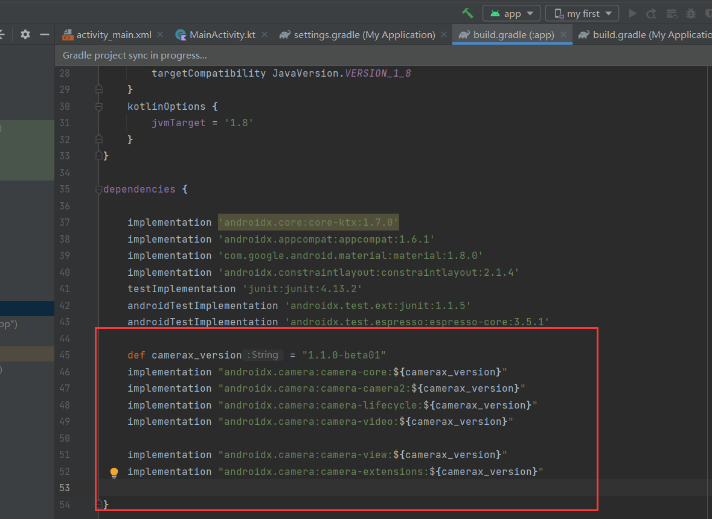

设置项目：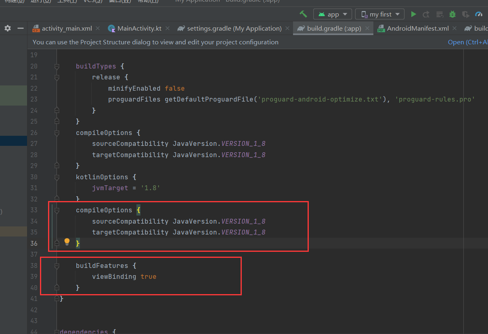

## 创建项目布局

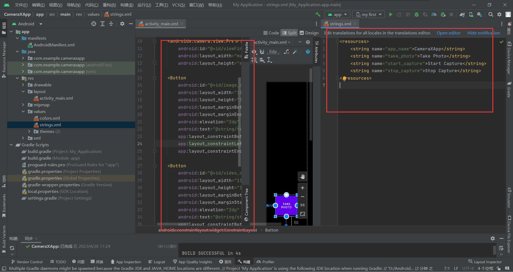

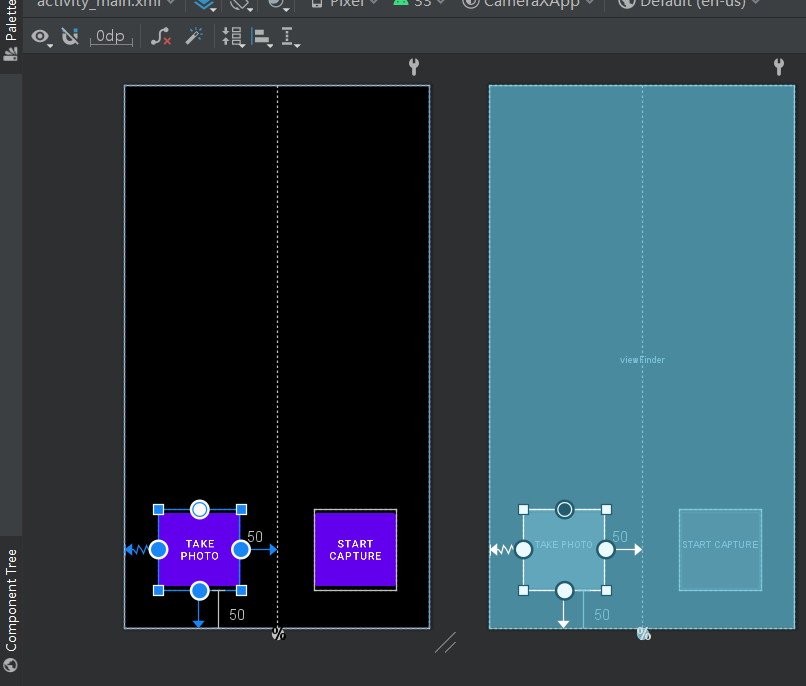

## 编写MainActivity.kt代码

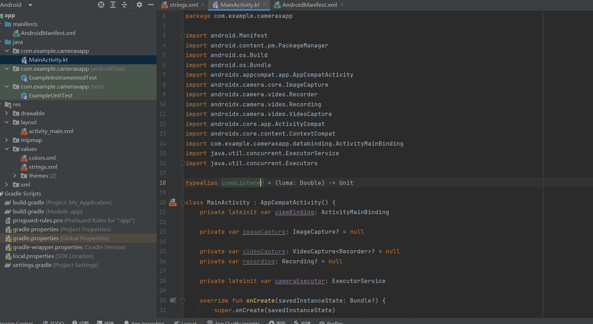

## 请求必要权限

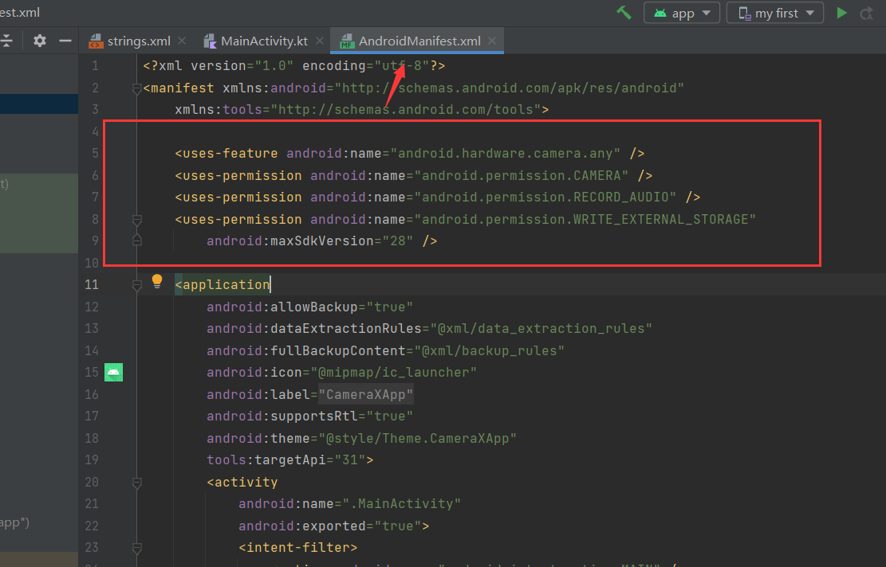

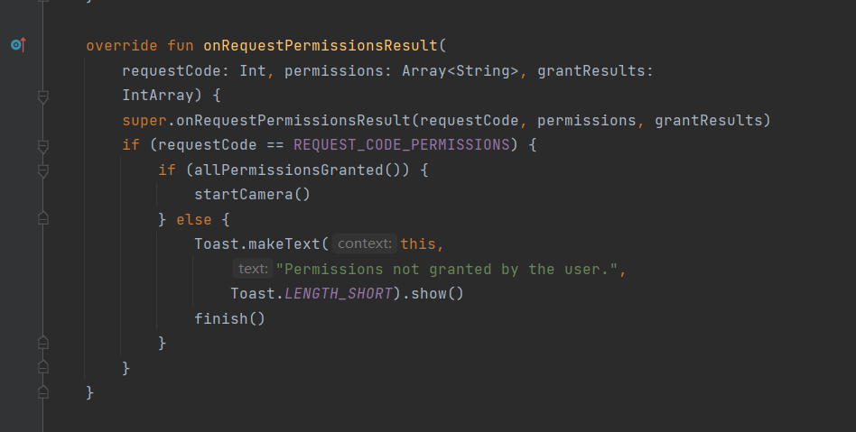

## 实现Preview用例

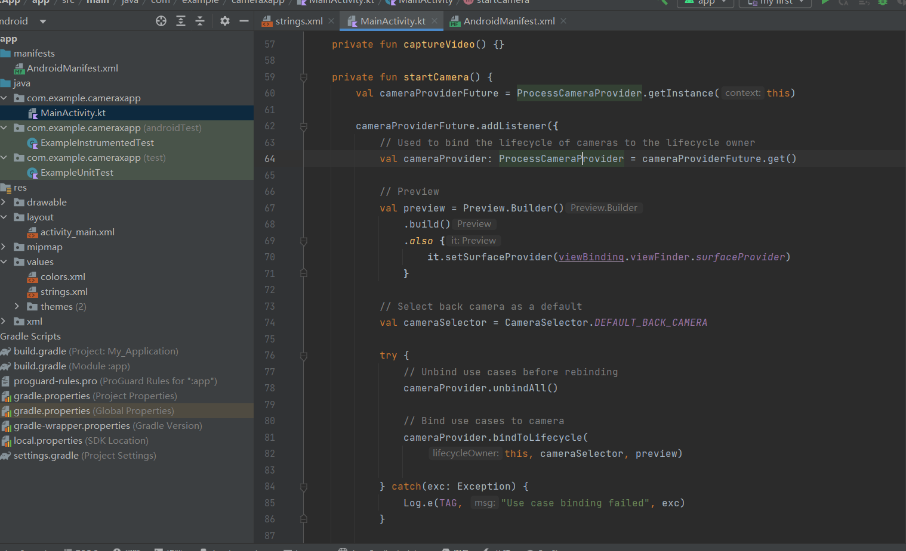

## 实现ImageCapture用例（拍照功能）

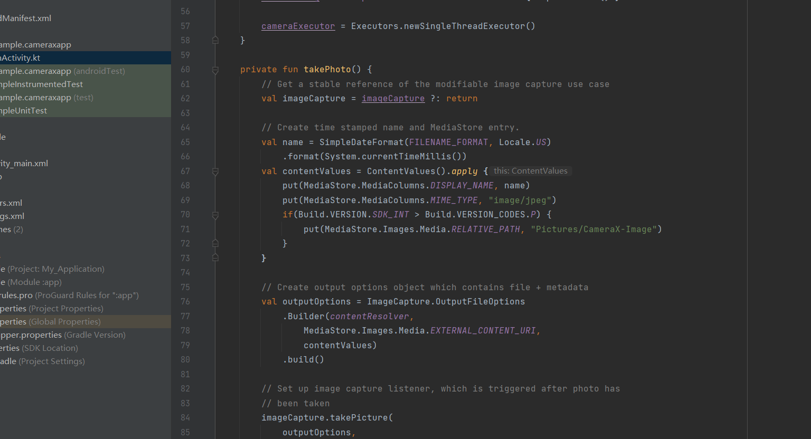

## 实现ImageAnalysis用例

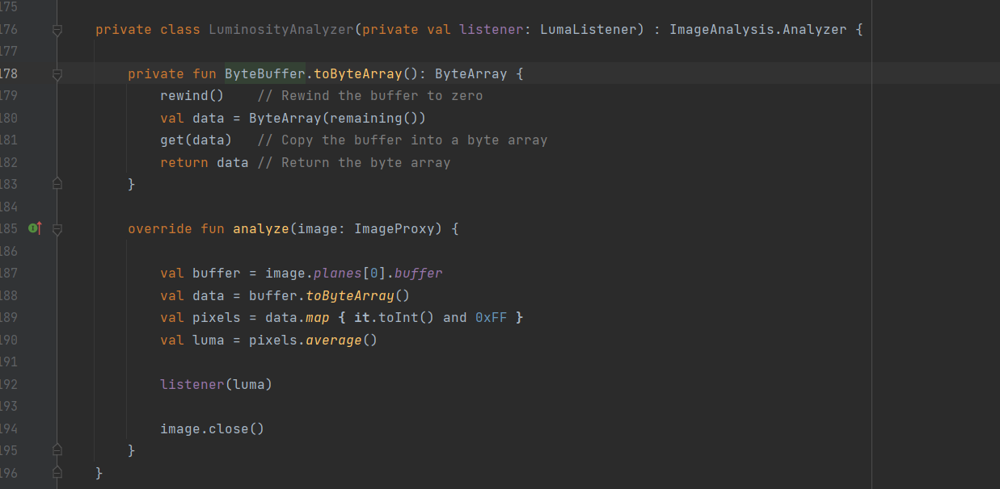

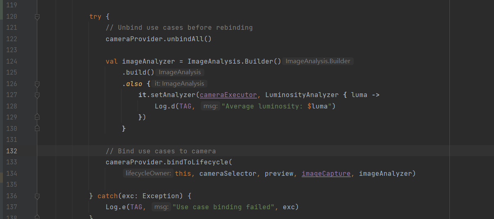

## 实现VideoCapture用例（拍摄视频）

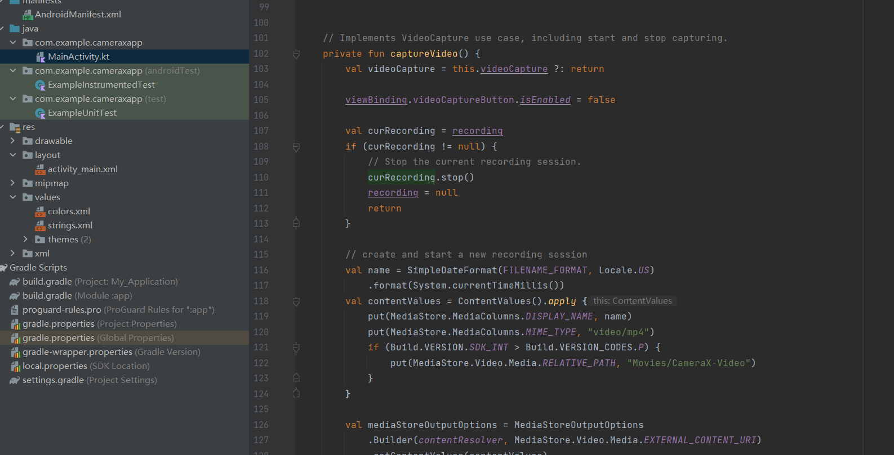

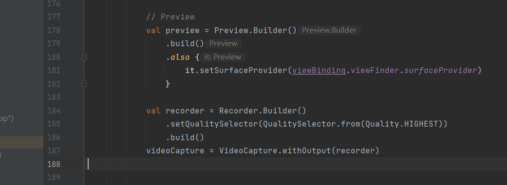

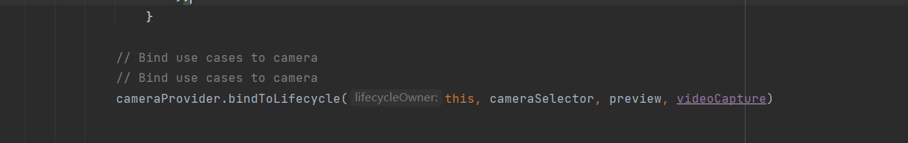

运行：

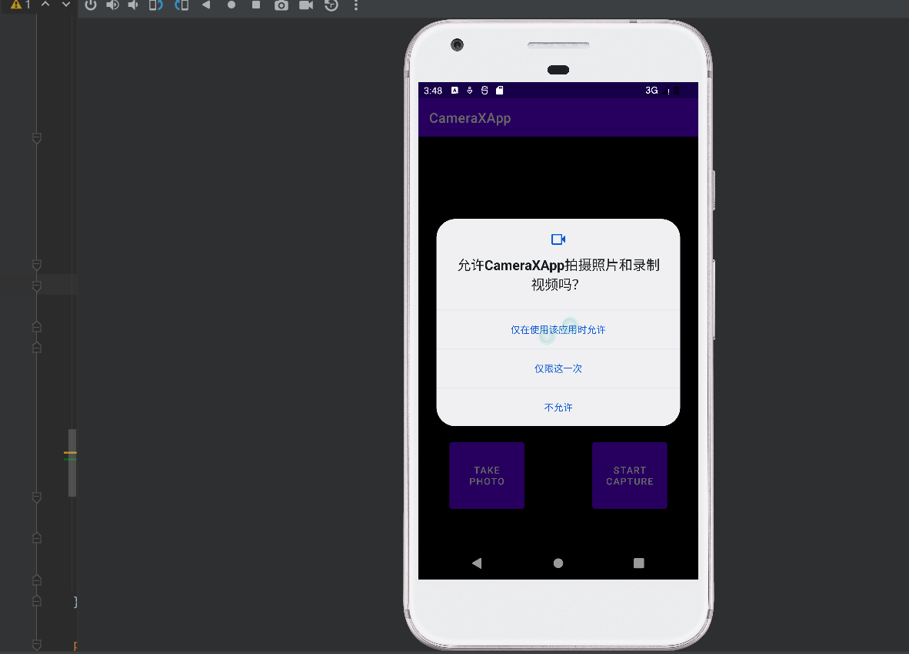

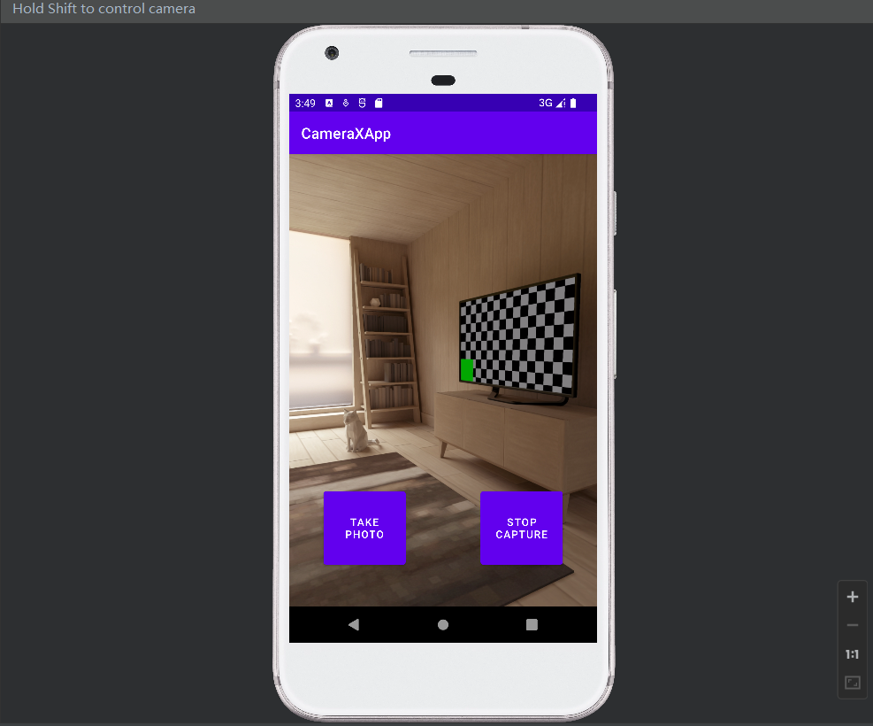

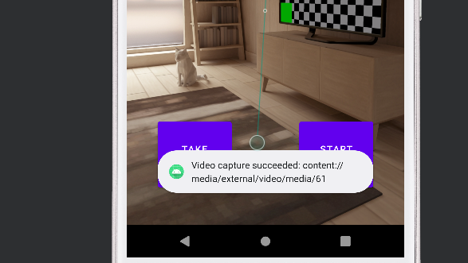

在虚拟机拍照一直会出现这个问题，所以寻求老师帮助，转到实体机测试，用我的手机应用会闪退，平板可以运行


运行结果：


可以看到运行成功